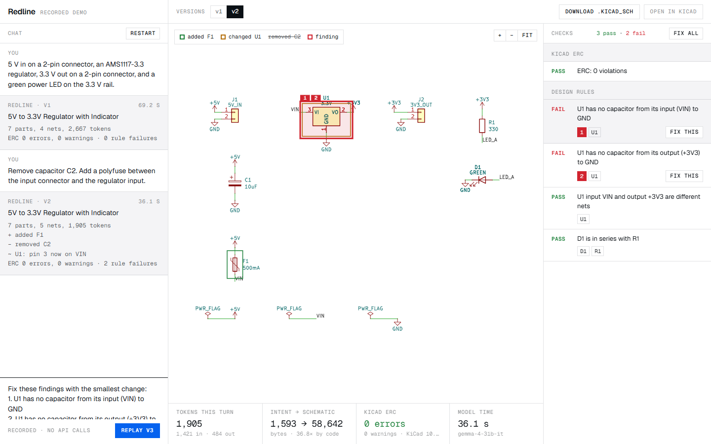
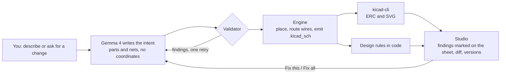

# Redline

Describe a circuit, get a real KiCad schematic, see ERC findings marked on the sheet, and fix them by chat.



## The problem

Language models are bad at drawing schematics. Asked for a `.kicad_sch` file they invent coordinates, pin positions
and file syntax, and the result either does not open or is wired wrong. A hardware engineer cannot trust it and
cannot easily see what is wrong with it.

## How it works

The model writes a tiny intent. Code draws everything. KiCad is the judge.



1. **Intent.** Gemma 4 returns a small JSON object: parts (`ref`, `libId`, `value`, `group`), nets (lists of pins
   such as `U1.3`), and no-connect pins. It contains no coordinates. It is checked with zod and by a validator
   (unknown symbol, unknown pin, duplicate ref, pin in two nets, pin in no net). If validation fails the model gets
   the numbered findings and one retry. Problems that code can settle are then repaired and flagged (see "Draft it
   and flag it"); otherwise nothing is written.
2. **Engine** (`lib/engine/`, deterministic, no model, unit tested).
   - `sexp`: own s-expression parser and writer.
   - `symbols`: reads symbol definitions and pin positions from the installed `.kicad_sym` libraries and resolves
     `extends` symbols.
   - `wired` (default style): parts sit in a row in signal-flow order on a common rail line, a connector whose
     pins face away from the circuit is mirrored, and a grid router draws every net as real wires with junctions.
     Each rail (`GND`, `+5V`, `+3V3`) gets one power symbol, and the sheet gets its title and a frame. Wires of
     different nets may only cross at right angles, never touch.
   - `place` and `connect` (label style, the fallback when a net cannot be routed, or `hints.wiring: "labels"`):
     one column per group, and each pin gets a short stub with a net label or a power symbol.
   - Undriven power nets get one `PWR_FLAG` in both styles, because KiCad's ERC requires it.
   - `emit`: writes the `.kicad_sch` with embedded library symbols and stable UUIDs, plus `layout.json` with each
     part's bounding box in sheet millimetres. The same intent always gives the same bytes.
3. **KiCad.** `kicad-cli sch erc --format json` checks the file and `kicad-cli sch export svg` draws it. The studio
   shows KiCad's own SVG. ERC findings are mapped back to parts through the UUIDs in `layout.json`.
4. **Design rules** (`lib/rules.ts`, code): a regulator has a capacitor from input to ground and from output to
   ground; every LED has a series resistor; a regulator's input and output are different nets.
5. **Revise with small edits.** A chat message or a finding goes back to the model with the current intent. The
   model does not rewrite the design: it returns a short list of operations (`add_part`, `remove_part`,
   `set_value`, `set_symbol`, `connect`, `no_connect`, `rename_net`), and code applies them (`lib/ops.ts`). What
   the operations do not mention cannot change. The result is validated, drafted and checked like a first draft,
   and the difference is shown on the sheet: added parts green, changed parts amber, removed parts listed.
6. **Ask.** A question ("why does the regulator need capacitors?") gets an answer in the chat instead of an edit:
   the model replies in words, no new version is created, and the answer is labelled as coming from the model and
   not checked.
7. **Explain the sheet.** Under the checks, "Short forms on this sheet" lists what every abbreviation in the
   drawing means: part letters (U, R, C, J), rails (`+3V3`, `GND`), pin names (`EN`, `NC`, `VIN`), value suffixes
   (`1u`, `10k`) and marks (`PWR_FLAG`). It comes from a fixed dictionary in `lib/glossary.ts`, not from the model,
   and only lists terms the sheet uses.
8. **Review.** Every change shows a bar with what it did and two buttons, Keep and Undo. Clicking a part on the
   sheet puts its ref in the chat box, so "R3: make this 4.7k" needs no typing of names. ERC and design-rule
   findings are shown to you, never fixed silently.

The file format was not written from memory: the emitter follows demo schematics that ship with KiCad, re-saved
by the installed KiCad 10 with `kicad-cli sch upgrade`, and every change was checked by loading the output in
`kicad-cli`. Those reference copies are not in this repository because they carry their authors' licences.

### Parts

Redline is not limited to a fixed list. It can use any single-unit symbol in the installed KiCad libraries (about
21,000 on a stock KiCad 10 install):

- A small core catalogue (regulators, R, C, LED, diodes, an NPN transistor, 2 to 4 pin connectors, a button) is
  always described to the model with its pin numbers, names and electrical types.
- `lib/engine/library-index.ts` scans every `.kicad_sym` file once and caches a search index. Part numbers in the
  request ("NE555", "ATmega328P", "LM7805") and generic words ("crystal", "relay", "npn") are looked up, and the
  matching symbols are added to the prompt with their real pin tables.
- If the model names a symbol that does not exist, or a pin a symbol does not have, the validator replies with the
  closest real symbols and their pins, and the model gets one retry.
- A net named after any KiCad power symbol (`GND`, `+5V`, `+3V3`, `+12V`, `+9V`, `VCC`, `VBUS`, ...) is drawn
  with that symbol.
- Small parts are joined with wires. A sheet with a part of more than 8 pins, or more than 10 parts, is drawn with
  net labels instead, which is how such sheets are usually drawn.

Checked by hand-written examples in `examples/` (an NE555 blinker and an ATmega328P board, both ERC-clean) and by
live runs: Gemma drew a correct NE555 astable and an LM7805 supply from one-line prompts.

`npx tsx scripts/catalogue.ts` prints the core catalogue text the model sees.

## Model

Gemma 4, `gemma-4-31b-it`, through the Gemini API (`@google/genai`), server-side only. Gemma 4 is released under
the [Apache 2.0 licence](https://ai.google.dev/gemma/apache_2). All model calls go through one `ModelProvider`
interface in `lib/model/provider.ts`.

## How to run

Requirements: Node 22, KiCad 10 installed (tested with 10.0.4 on Windows 11), and a Gemini API key.

```bash
npm install
```

Copy `.env.example` to `.env.local` and set `GEMINI_API_KEY`. KiCad is located automatically; set `KICAD_CLI` and
`KICAD_SYMBOL_DIR` only if it is not found.

```bash
npm run dev
```

Then open http://localhost:3000. The app runs locally only, because it needs `kicad-cli` on the same machine.
`/studio` is the app. `/studio?demo=1` replays a recorded session from `demo/`
with no API or kicad-cli calls.

Without the UI:

```bash
npx tsx scripts/draft.ts examples/reg-3v3.intent.json
```

drafts the hand-written 5 V to 3.3 V regulator (no model) into `runs/reg-3v3/v1/` and prints the kicad-cli output.
`examples/mic5317-3v3.intent.json` is the same job with a MIC5317-3.3YM5 and JST GH connectors.

```bash
npm test
```

runs the unit tests and the acceptance tests, which call the real kicad-cli.

Each version of a session is stored in `runs/<session>/v<n>/` as `intent.json`, `design.kicad_sch`, `erc.json`,
`design.svg`, `layout.json` and `meta.json`.

## Eval

`scripts/eval.ts` drafts the 10 prompts in `data/prompts.json` with live Gemma, waits between calls, and gives any
draft that is not clean one fix round. Each draft is judged two ways:

- **KiCad ERC and the design rules** say whether the sheet is electrically consistent.
- **Golden answers** say whether it is the circuit that was asked for. `data/golden.ts` holds a hand-written
  reference circuit for every prompt, with the valid variants (a resistor on either side of its LED, a fuse before
  or after a diode). The matcher in `lib/golden.ts` ignores the model's choice of refs and net names, requires the
  rails to be named, and reports a draft as exact, as a superset (the reference circuit plus extra parts), or as a
  mismatch with the reason. A reversed LED passes ERC and fails here.
 Run of 4 October 2026 on the wired engine, `gemma-4-31b-it`, minimal
thinking, KiCad 10.0.4:

| Measure | Result |
| --- | --- |
| ERC-clean first time (0 errors, 0 warnings) | 10 / 10 |
| ERC-clean after one fix round | 10 / 10 |
| ERC and design rules clean first time | 10 / 10 |
| Matches the golden answer first time | 10 / 10, all exact |
| Drafts that needed the validation retry | 0 / 10 |
| Drafts drawn with routed wires (no fallback to labels) | 10 / 10 |
| Prompts lost to API errors | 0 / 10 |
| Tokens per draft (average) | 1,890 |
| Model time per draft (min / average / max) | 31 s / 66 s / 198 s |

Read these numbers with care:

- The prompts are short and stay inside the catalogue. They are not a hard test.
- Much of the ERC result is the engine's doing, not the model's: it adds `PWR_FLAG` where needed and the validator
  refuses any intent with an unassigned pin. ERC-clean means the file is electrically consistent, not that the
  circuit is what was asked for; the golden answers are what check that.
- The golden answers were written by the same people who wrote the prompts, and they check connections, part types
  and one requested value (the 10k pull-down). They do not check other component values, and they were scored on
  the saved drafts of this run with `npx tsx scripts/golden.ts`, not during it.
- No draft needed the fix round, so this run does not measure it. The fix path was exercised separately in the
  studio (a removed capacitor and a removed LED resistor were both repaired in one round).
- The hosted model answered 500 or 503 four times during the run; every call succeeded on retry.
- An earlier run on the label-style engine gave the same 10 / 10.

The raw output is in `data/eval-output.txt` and the per-prompt results in `data/eval-results.json`.

```bash
npx tsx scripts/eval.ts
```

## More

- [docs/STACK.md](docs/STACK.md): the choice and the reason for every layer, and the one-command tasks.
- [docs/LEARNINGS.md](docs/LEARNINGS.md): dated notes on what went wrong and what we changed.

## Harder prompts

`scripts/stress.ts` sends three larger requests through the live model:

| Request | Result |
| --- | --- |
| ESP32-WROOM-32 board with USB-C power, AMS1117, reset and boot buttons, LED, UART header | 11 parts, 0 ERC errors, 0 warnings, one validation retry, 162 s. It used a plain 2-pin connector where a USB-C connector was asked for. |
| 12 V dual-rail supply with fuse, diode, LM7805, AMS1117-3.3, LEDs and a header | 14 parts, 0 ERC errors, 0 warnings, 82 s. It used an AMS1117-5.0 where an LM7805 was asked for. |

| ATmega328P board with crystal, reset, decoupling, ISP and UART headers, LED | First run: rejected after two attempts, nothing drawn (17 unused pins not listed, one pin on two nets). After the draft-and-flag change below: 13 parts, 0 ERC errors, 1 warning, two auto-repairs shown as warnings. The draft still has real mistakes: a decoupling capacitor left on its own net, and SCK and MOSI on the wrong port pins. |

So larger designs come out valid as files, but the model substitutes parts and makes wiring mistakes. That is the
kind of thing the engineer corrects in chat ("use an LM7805 for U1"), and the edit shows up as a one-line diff.

### Draft it and flag it

Redline used to refuse to draw when the model's answer broke a structural rule twice. Now `lib/engine/repair.ts`
settles what code can settle and draws the sheet, listing each repair as a warning in the checks panel:

- a pin the model never mentioned is marked no-connect (applied at once, with no second model call);
- a pin put on two nets stays on the first;
- a pin or part that does not exist is dropped from the net.

It still refuses when nothing drawable was returned: a symbol that does not exist, a multi-unit symbol, or a reply
that is not JSON.

## Limits

- Multi-unit symbols (dual and quad op-amps, logic gates) are rejected; use a single-unit part.
- One sheet only, and Redline edits only schematics it drew itself; it cannot open an existing `.kicad_sch`.
- Parts outside the core catalogue depend on the model knowing how to use them. It can wire a legal but wrong
  circuit: in one live run it left a transistor's collector unconnected to its load. KiCad's ERC flagged that one
  as a warning; the design rules and golden answers only cover the circuits they were written for.
- The wire router is simple. It is tidy for a row of parts such as a regulator block; on busier circuits the wires
  are correct but can take roundabout paths. Parts are drawn in the order the intent lists them.
- The eval prompts only use core-catalogue parts. Library parts were checked with the examples, the acceptance
  tests and three live prompts, not with the eval.
- KiCad's mounting-pin connector symbol has one mounting pin; the JST GH part has two pads.
- The design rules are three checks, not a review.
- The hosted Gemma endpoint was slow (40 to 110 s per call) and returned occasional 500/503 errors during
  development; the provider retries twice.

## Credit

The intent-then-deterministic-draft idea comes from [Copperhead](https://github.com/copperheadhq/copperhead). Only
its README and spec were read for the idea; no Copperhead code is used. The visual language (white ground, square
corners, hairlines, Geist, one blue) follows supermemory.ai; none of their assets or text are used.

## Licence

MIT, see [LICENSE](LICENSE).
